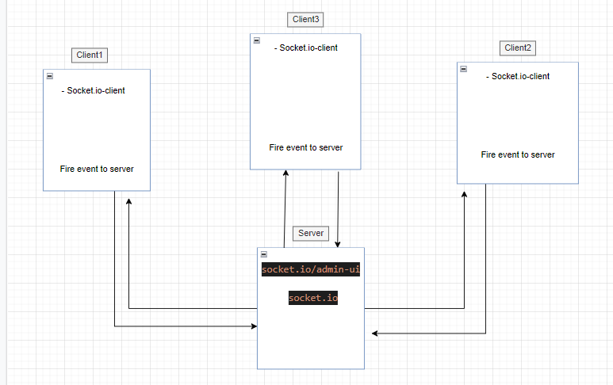

# messaging-system

## Uml Diagram :

## Documntation :
I have created an application called message-system to contact client with each others using messages. 
I used socket.io and socket.io-client to link between server and clients.

Create an html GUI that contains a form which sends messages from the client and joins to a room.

build the application using socket.io, socket.io-clent, socket.io/admin-ui, and snowpack. They were used to fire events from the client to the server, also from the server to the clients.

